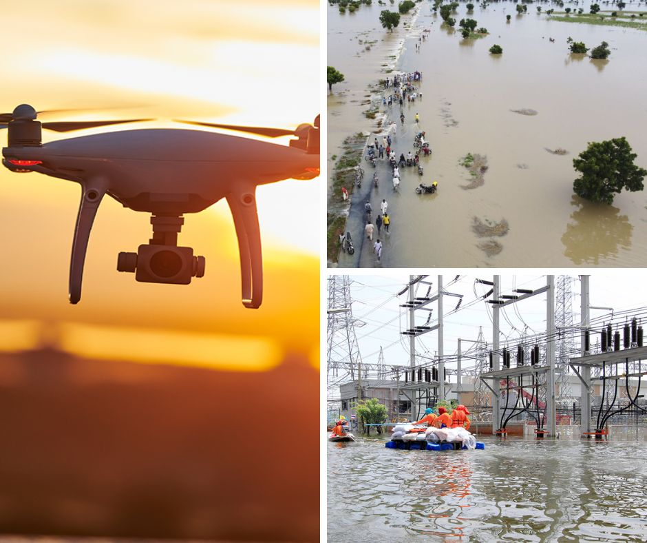
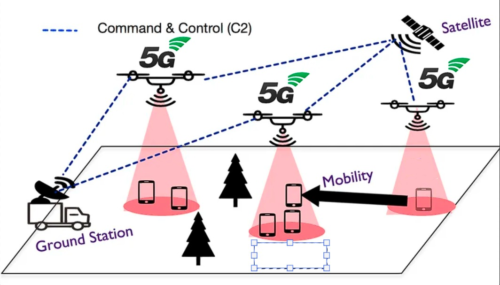

<h1 align="center">GSL-Iot-LosMerengues</h1>
<p align="left">Iot Project developed by the multicultural team involving the ITESM (Mexico) and ITA (Brazil)</p>
<h3 align="center">Defining the problem and our Motivation</h3>

Natural disasters have increased in recent years as a result of climate change, which is advancing unstoppably due to human interaction with nature. These cause human losses and represent a high economic cost. For example, in 2017, a series of fires and hurricanes that occurred in the United States were the natural disasters that left the most damage, followed by Typhoon Jebi that hit Russia, Japan and Taiwan, with losses of more than 12.5 billion dollars.

Natural disasters can be climatological (droughts, fires and glacier outburst), geophysical (earthquakes and volcanic activity), hydrological (floods and prolonged rains) and meteorological (storms, extreme temperatures and fog). These types of phenomena have caused 22.5 million people to be displaced annually between 2008 and 2014.

Among the worst catastrophes in recent years is Cyclone Idai, which affected countries such as Mozambique, Zimbabwe and Malawi in 2019 and resulted in more than 1,000 deaths and 1.5 million displaced people. In 2017, a drought affected Somalia and was ranked as the worst in the last 60 years; and in 2016 the earthquake that hit Ecuador is ranked as one of the worst disasters for causing the death of more than 600 people, leaving more than 4,000 injured and damage to infrastructure.

Technologies are presented as an environment with the potential to contribute to create better living conditions for citizens affected by natural disasters, either from a preventive point of view or to serve as a guide to the inhabitants when the disaster is occurring.

This paper will specifically address the issue of drones in natural disasters.
The main advantages of these are:
1. Access to inaccessible places
2. Speed
3. Geolocation
4. Thermography
5. Autonomy and flight time

The actions in natural disaster situations include a first phase of emergency action and a second phase of damage assessment. Drones are suitable tools for both phases. Both tasks can be prolonged indefinitely.

In this project our group will work to build a resilient infrastructure when there is a natural hazard, motivated by the goal of sustainable development based on “Industry, Innovation and Infrastructure” and “Sustainable Cities and Communities”. The scenario that the project is inserted is related to a flood. As the climate and environment are already being altered to a greater degree for the increase in frequency and unpredictability of weather events usually in tropical countries such as Brazil and the environment fatalities and always in tropical countries such as Brazil and the environment fatalities and natural disasters. incalculable (financial and social) for the population. In this way, our motivation rescue is through rescue channels, with the purpose of providing a Command and Control (C2) structure in which it is possible to use voice and data transmission for planning and executing actions.

All these tools and others have been greatly simplified with the emergence of new technologies, which contribute different effective developments to improve the work of emergency services. Definitely being part of this project will help to save lives.


</a>

<!-- TABLE OF CONTENTS -->
## Table of Contents
<details>
  <summary>Display Elements</summary>
  <ol>
    <li>
      <a href="#step-deliverables">STEP Deliverables</a>
      <ul>
        <li><a href="#step-1">STEP 1</a></li>
        <li><a href="#step-2">STEP 2</a></li>
        <li><a href="#step-3">STEP 3</a></li>
        <li><a href="#step-4">STEP 4</a></li>
      </ul>
    </li>
    <li>
      <a href="#about-the-project">About The Project</a>
      <ul>
        <li><a href="#requirements--project-setup">Requirements & Project Setup</a></li>
        <li><a href="#must-read-for-viewers">Must READ for viewers</a></li>
      </ul>
    </li>
    <li>
      <a href="#getting-started">Getting Started</a>
      <ul>
        <li><a href="#built-with">Built With</a></li>
        <li><a href="#prerequisites">Prerequisites</a></li>
        <li><a href="#runing-the-project">Runing the Project</a></li>
      </ul>
    </li>
    <li><a href="#roadmap--schedule-%EF%B8%8F%EF%B8%8F">Roadmap && Schedule</a></li>
    <li><a href="#contributing">Contributing</a></li>
    <li><a href="#license">License</a></li>
    <li><a href="#contact">Contact</a></li>
    <li><a href="#acknowledgments">Acknowledgments</a></li>
    <li><a href="#team-members">Team Members</a></li>
  </ol>
</details>

<!-- DELIVERABLES -->
## STEP Deliverables

### STEP 1

<details>
  <summary>Display Elements</summary>
  <ul>
    <li><a href="#built-with">Built With</a></li>
    <li><a href="#prerequisites">Prerequisites</a></li>
    <li><a href="#requirements--project-setup">Requirements & Project Setup</a></li>
    *Here at Requirements && Project Setup we have links to the Project in GitHub projects and the Requirements.md*
    <li><a href="#roadmap--schedule-%EF%B8%8F%EF%B8%8F">Roadmap && Schedule</a></li>
    <li><a href="#license">License</a></li>
  </ul>
</details>

### STEP 2

**Updated Installation Documentation**.
[Here](https://www.youtube.com/channel/UCFnfEv69GhJT3s-khTIS3qw) is the YouTube Channel with the videos regarding the 2do STEP deliverables.
[](https://www.youtube.com/embed/fVMFK4tlKYw)

### STEP 3

**Updated Installation Documentation**.
[Here](https://www.youtube.com/channel/UCFnfEv69GhJT3s-khTIS3qw) is the YouTube Channel with the videos regarding the 3rd STEP deliverables.
[](https://www.youtube.com/embed/VXGsvP3AHxk)
The Source Videos for the previous one are available here:
[](https://www.youtube.com/embed/oUROhiYm_vA)
[](https://www.youtube.com/embed/oTmXYivuezo)
https://youtu.be/oUROhiYm_vA
### STEP 4

The link to our presentation slides.
Video of the presentation.
Text file with the Address of the GitHub project

<!-- ABOUT THE PROJECT -->
## About The Project

We want to create a project that takes advantage of current technological advances, our project will have as a key point the provision of a 5G data network through drones. Thus, our focus is to develop a Command and Control (C2) system that helps rescue teams. To simulate this scenario, virtual machines will be used that simulate the drones and the customers (rescue team and people in need). Through the availability of 5G data signal by drones (mini-servers) customers will connect to a portal with their personal data and will be able to inform their position for rescue. In our scope we expect to develop applications with low level of data transmission, but with high efficiency reducing the cost of data transmission.

<a href="https://github.com/Djmr5/Iot-LosMerengues/blob/main/images/5gdrones.jpeg?raw=true">

</a>

### Requirements && Project Setup

First we defined some technical and non-technical requirements to develop our solution to meet these.
Look at those requirements [here](/documentation/requirements.md)

A new project was also created to keep track of tasks and useful information.
Look at the project [here](https://github.com/users/Djmr5/projects/1) or at the projects section of this repository.

### Must READ for viewers
* This project is still in development, please let us know if you want to add or decrease something that might cost us time.
* We are not expecting to keep updating the project after December 2022.
* Feel free to help us! :smile:

<p align="right">(<a href="#table-of-contents">Back to Top</a>)</p>

<!-- GETTING STARTED -->
## Getting Started

### Built With

List of major frameworks/libraries used to develop the project.

1. The frameworks/libraries are required to develop and run the complete application data flow.
2. If you're using the latest version of Java Development Kit, you'll need to change the Gradle version of your project
3. If you have already installed Node on your system, make sure it is Node 14 or newer.
4. More details about the React Native setup are available [here](https://reactnative.dev/docs/environment-setup)

       

### Prerequisites

To setup the environment from zero we recommend following these steps:

:exclamation: In case of issues during setup, the documentation for all frameworks and dependencies are available online and we suggest reading the documents along with these instructions.

1. Install [Node.js](https://nodejs.org/en/download/) 14 or newer.
    - In case you are on Windows and don't have chocolatey already installed, the Node installer will do for you.

2. Install the Java Development Kit 11 (JDK) (/recommended/).
    - You can look at your JAVA version with ```java -version``` at the powershell terminal.
    - In case you are on Windows and have chocolatey installed you can run at the powershell terminal.

    ```sh
    choco install -y nodejs-lts openjdk11
    ```
    - You can also download JDK 11 from [here](https://www.oracle.com/mx/java/technologies/javase/jdk11-archive-downloads.html)
    - In case you want to use another JDK you must change the Gradle version of your project. Follow the steps on the [React Native documentation](https://reactnative.dev/docs/environment-setup) for more details.

3. Install [Android Studio](https://developer.android.com/studio/index.html) and check during the installation for:
    - Android SDK
    - Android SDK Platform
    - Android Virtual Device
      * All of them can be done later on.

4. From here, we highly endorse the following steps on React Native environment setup documentation until *Creating a new application* section.
    - If you followed the previous steps, you can skip to the *Android development environment 2. Install the Android SDK* section.

5. Clone the [Android App](/clientMqtt) inside the folder clientMqtt of this repo into a new project in your Android Studio.
    - Run the following command to uninstall a global ```react-native-cli``` package, please remove it as it may cause unexpected issues:
    ```sh
    npm uninstall -g react-native-cli @react-native-community/cli
    ```
    - If you got trouble while cloning theclientMqtt files you can initialize your own project with:
    ```sh
    npx react-native init AwesomeProject
    ```
      - Then replace the app file of your new project with the [app.js](/clientMqtt/App.js) at clientMqtt.

6. Create the [Virtual Device](https://developer.android.com/studio/run/managing-avds.html) to run the Application.
    - If you want to use a physical device you can look at the instructions [here](https://reactnative.dev/docs/running-on-device).
    - Don't forget to create your Android virtual device as we intentionally created the client for Android.

:earth_americas::computer: **Virtual Machine**

7. Create a Virtual Machine or use your Local Environment to setup Mosquitto, SQL db and Grafana.
    - If you are willing to use a VM hosted on a external PC you can use Microsoft Azure Virtual Machines.
    - :exclamation: By using an Azure VM you must pay for the VM usage.
      * We selected Ubuntu 20.04 as the OS of our VM.
      * Using an Azure VM requires more steps like:
        - Creating users and setting up the VM.
        - Connect to the VM via ssh.
        - Opening ports.

8. Install Mosquitto
  * :exclamation: Here is a step by step guide to configure Mosquitto for Ubuntu 20.04, you might want to search for the installation documentation for your OS if using another one.
    - To install mosquitto you must execute the following commands:
    ```sh
    sudo apt-get install mosquitto
    ```
    ```sh
    sudo apt-get install mosquitto-clients
    ```
    ```sh
    sudo apt clean
    ```
    - Now mosquitto is installed and we continue to configure the files with the following commands:
    ```sh
    cd /etc/mosquitto
    ```
    - Here you might clone or copy the mosquitto files used in this project or configure the ones you want with the mosquitto documentation.
    - Mosquitto Documentation is available [here](https://mosquitto.org/documentation/) as if you need more help.
  * :exclamation: Remember to open and configure all the required ports.

9. Install MYSQL
  * :exclamation: Here is a step by step guide to configure MYSQL for Ubuntu 20.04, you might want to search for the installation documentation for your OS if using another one.
    - To install MYSQL you must execute the following commands:
    ```sh
    sudo apt install mysql-server
    ```
    ```sh
    sudo systemctl status mysql
    ```
    ```sh
    sudo mysql -uroot
    ```
    - Now MYSQL is installed and you must get the db form the source code.

10. Install Grafana
  * :exclamation: Here is a step by step guide to configure Grafana for Ubuntu 20.04, you might want to search for the installation documentation for your OS if using another one.
    - To install Grafana you must execute the following commands:
    ```sh
    sudo apt install grafana-server
    ```
    ```sh
    wget https://dl.grafana.com/enterprise/release/grafana-enterprise_9.2.6_amd64.deb
    ```
    ```sh
    sudo dpkg -i grafana-enterprise_9.2.6_amd64.deb
    ```
    - To get Grafana runing automatically you can configure.
    ```sh
    sudo /bin/systemctl daemon-reload
    ```
    ```sh
    sudo /bin/systemctl enable grafana-server
    ```
    - If not you can get it running manually with:
    ```sh
    sudo /bin/systemctl start grafana-server.service
    ```

### Runing the Project

To run the Application run at two terminals each command:

  - To start Metro:

  ```sh
  npx react-native start
  ```

  - To run the app (can also be run directly from Android Studio)

  ```sh
  npx react-native run-android
  ```


 <!-- ROADMAP -->
## Roadmap && Schedule ⏲️⏲️<a name = "schedule"></a>

<table style="border-collapse: collapse; width: 100%">
      <tr>
        <th colspan="3" style="border: 1px solid #dddddd; padding: 8px;">Project Schedule</th>
      </tr>
      <tr>
        <td colspan="2" style="border: 1px solid #dddddd; text-align: left; padding: 8px;">Opening Class - :white_check_mark: </td>
        <td style="border: 1px solid #dddddd; text-align: left; padding: 8px;">1st Nov 2022 19:00 (GMT-5)</td>
      </tr>
      <tr>
        <td rowspan="2" style="border: 1px solid #dddddd; text-align: left; padding: 8px;">Icebreaker</td>
        <td style="border: 1px solid #dddddd; text-align: left; padding: 8px;">Step 1 - Icebreaker Video :white_check_mark:</td>
        <td style="border: 1px solid #dddddd; text-align: left; padding: 8px;">3 Nov 2022 23:59 (GMT-5)</td>
      </tr>
      <tr>
        <td style="border: 1px solid #dddddd; text-align: left; padding: 8px;">Step 2 - Reply to the peers :white_check_mark: </td>
        <td style="border: 1px solid #dddddd; text-align: left; padding: 8px;">4 Nov 2022 23:59 (GMT-5)</td>
      </tr>
      <tr>
        <td rowspan="4" style="border: 1px solid #dddddd; text-align: left; padding: 8px;">Collaboration</td>
        <td style="border: 1px solid #dddddd; text-align: left; padding: 8px;">Step 1 – Project Setup :white_check_mark:</td>
        <td style="border: 1px solid #dddddd; text-align: left; padding: 8px;">11 Nov 2022 23:59 (GMT-5)</td>
      </tr>
      <tr>
        <td style="border: 1px solid #dddddd; text-align: left; padding: 8px;">Step 2 – Client & Edge Stage :hourglass:</td>
        <td style="border: 1px solid #dddddd; text-align: left; padding: 8px;">18 Nov 2022 23:59 (GMT-5)</td>
      </tr>
      <tr>
        <td style="border: 1px solid #dddddd; text-align: left; padding: 8px;">Step 3 – Cloud Stage :hourglass:</td>
        <td style="border: 1px solid #dddddd; text-align: left; padding: 8px;">25 Nov 2022 23:59 (GMT-5)</td>
      </tr>
      <tr>
        <td style="border: 1px solid #dddddd; text-align: left; padding: 8px;">Step 4 – Final Presentation :hourglass:</td>
        <td style="border: 1px solid #dddddd; text-align: left; padding: 8px;">2 Dec 2022 23:59 (GMT-5)</td>
      </tr>
      <tr>
        <td colspan="2" style="border: 1px solid #dddddd; text-align: left; padding: 8px;">Reflection :hourglass:</td>
        <td style="border: 1px solid #dddddd; text-align: left; padding: 8px;">3 Dec 2022 23:59 (GMT-5)</td>
      </tr>
    </table>

- [x] Add Complete Schudele 
- [x] Create README and define requirements
- [x] Android Client, Mosquitto Broker and installation of mininet
    - [x] Update README with installation instructions
- [ ] Add "components" document to easily copy & paste sections of the readme
- [ ] Multi-language Support
    - [x] English
    - [ ] Spanish
    - [ ] Portuguese

<p align="right">(<a href="#table-of-contents">Back to Top</a>)</p>


<!-- CONTRIBUTING -->
## Contributing

Contributions are what make the open source community such an amazing place to learn, inspire, and create. Any contributions you make are **greatly appreciated**.

If you have a suggestion that would make this better, please fork the repo and create a pull request. You can also simply open an issue with the tag "enhancement".
Don't forget to give the project a star! Thanks again!

1. Fork the Project
2. Create your Feature Branch (`git checkout -b feature/AmazingFeature`)
3. Commit your Changes (`git commit -m 'Add some AmazingFeature'`)
4. Push to the Branch (`git push origin feature/AmazingFeature`)
5. Open a Pull Request

<!-- LICENSE -->
## License

Distributed under the MIT License. See [LICENSE.txt](/LICENSE.txt) for more information.

<!-- CONTACT -->
## Contact

Project Link: [https://github.com/Djmr5/Iot-LosMerengues](https://github.com/Djmr5/Iot-LosMerengues/)

<!-- ACKNOWLEDGMENTS -->
## Acknowledgments

* [Choose an Open Source License](https://choosealicense.com)
* [GitHub Emoji Cheat Sheet](https://www.webpagefx.com/tools/emoji-cheat-sheet)
* [Instituto Tecnológico de Aeronáutica](http://www.ita.br/)
* [Global Shared Learning Classroom]( https://global.tec.mx/en/global-shared-learning)

<p align="right">(<a href="#table-of-contents">Back to Top</a>)</p>

<!-- TEAM MEMBERS -->
## Team Members

<h3 align="center">Françoa Taffarel</h3>
<p align="left">  </p>
<p align="left"> <a href="https://github.com/ryo-ma/github-profile-trophy"></a> </p>
<p></p>
<p>&nbsp;</p>
<p></p>

<h3 align="center">Diego Jacobo Martínez</h3>
<p align="left">  </p>
<p align="left"> <a href="https://github.com/ryo-ma/github-profile-trophy"></a> </p>
<p></p>
<p>&nbsp;</p>
<p></p>

<h3 align="center">Carlos Damián Suárez Bernal</h3>
<p align="left">  </p>
<p align="left"> <a href="https://github.com/ryo-ma/github-profile-trophy"></a> </p>
<p></p>
<p>&nbsp;</p>
<p></p>

<h3 align="center">Carlos Mendoza Medina</h3>
<p align="left">  </p>
<p align="left"> <a href="https://github.com/ryo-ma/github-profile-trophy"></a> </p>
<p></p>
<p>&nbsp;</p>
<p></p>

<h3 align="center">Fernando Dantas</h3>
<p align="left">  </p>
<p align="left"> <a href="https://github.com/ryo-ma/github-profile-trophy"></a> </p>
<p></p>
<p>&nbsp;</p>
<p></p>

<h3 align="center">Marco Iván</h3>
<p align="left">  </p>
<p align="left"> <a href="https://github.com/ryo-ma/github-profile-trophy"></a> </p>
<p></p>
<p>&nbsp;</p>
<p></p>

<h3 align="center">Andrew Steven Williams</h3>
<p align="left">  </p>
<p align="left"> <a href="https://github.com/ryo-ma/github-profile-trophy"></a> </p>
<p></p>
<p>&nbsp;</p>
<p></p>

<p align="right">(<a href="#table-of-contents">Back to Top</a>)</p>
